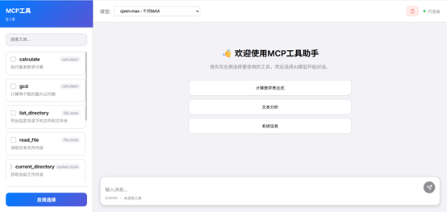
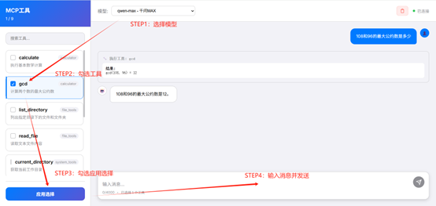

## 项目简介

一个简易的MCP工具开发、调试的工具，主要用于半封闭网络环境下，快速开发与测试MCP工具。

## 运行环境

python version>=3.12.8

## 快速开始

将代码复制到本地目录

终端运行

pip install -r requirements.txt

python start_all.py

终端显示

	🎉 所有服务启动成功！
	
	🌐 请访问: http://localhost:5000
	
	📝 实时日志监控已启动...

浏览器输入http://localhost:5000/

即可访问

## 对话界面使用

## 工具编写

在tools文件夹下新建.py文件,在文件内先添加函数：

	def mcp_tool(description: str = "", parameters: dict = None):
		"""MCP工具装饰器"""
		def decorator(func):
			func._mcp_tool = {
				'description': description,
				'parameters': parameters or {}
			}
			return func
		return decorator

随后函数参照如下格式：

	@mcp_tool(
	    description="{工具描述}",
	    parameters={
		"{工具输入变量}": {"type": "{变量类型}", "description": "变量描述"},
	  	{其他变量格式参照同上}
	    }
	)

	def {方法名}({输入参数}):
		……
		具体代码
		……
		return 返回值

编写完毕后，重启服务，左侧即可加载MCP工具

## 参数配置

config.json中可进行参数配置

mcp_server为mcp服务器开放的IP和端口

web_server为web服务器开放的IP和端口

llm可配置模型相关的内容，其中id为连接参数的modelName，name和description显示在模型选择界面

## 版本计划

当前版本 v0.0.1.5

后续计划更新：

1.英文版本的界面及README

2.多个AI串并联工作链路
